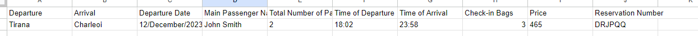
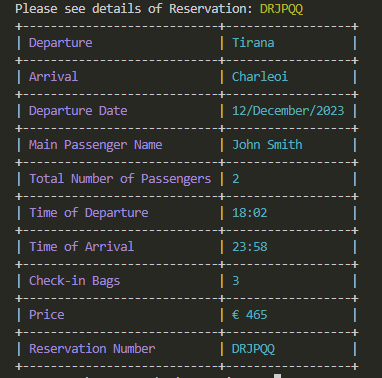
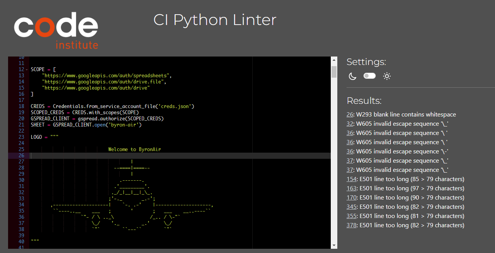

# $${\color{gold}ByronAir \space Airline}$$

## **Python Command Line Ticket Booking System**

> This application is Python based Flight ticket booking system. User is able to book tickets from Destinations in Europe. Customer is able to specify name, amount of bags and select desired flight. Booking creates reservation number which can be retrieved later to check booking details.
> All bases and created bookings are available in this [Spreadsheet](https://docs.google.com/spreadsheets/d/13a70DgGfpnCKCHinh6Xt_CvlNsL3aNJ22Z5P98DCp1c/edit?usp=sharing).

### [Live Site](https://byron-air-b087f2b64028.herokuapp.com/)

### [Repository](https://github.com/JarekB-dev/byron-air)

## Table of Contents

1. [Preplanning](#ux)
2. [Features to Implement](#features)
3. [Technologies Used](#technologies)
4. [Testing](#testing)
5. [Bugs](#bugs)
6. [Deployment](#deployment)
7. [Content](#resources)
8. [Acknowledgments](#acknowledgments)

# $${\color{orange}Features \space to \space Implement}$$

- Get access to Ryanair flight database:

  > Instead of creating random flights with random hours, I would like to link my application to flight live data for user to choose from. Still thinking about prices as these seems depend on to many factors.

- Give User access to edit created Booking:

  > At the moment application allows only to view created Booking, however in the future I am planning to enable users the possibility to edit booking details(with some restrictions), then price of the booking will be updated and old booking deleted and new booking created in the spreadsheet.

- Expand options to select seats and link external website to book parking depending on the location:

  > At the moment application does not allow users to select desired seats. I would like to create system similar to Ryanair, where price depends on the seat row or legroom. Also creating external dummy website with parkings in different locations would enhance user experience - New spreadsheet to pull parking locations, prices etc.

- Booking confirmation on email.
  > Currently, Booking is only being created in the spreadsheet and Reservation Number is being presented to the User - if number will be forgotten then there is no way to retrieve booking. I am planning to send all booking information to user email after creating Booking.

# $${\color{orange}Technology \space Used}$$

### [Python](<https://en.wikipedia.org/wiki/Python_(programming_language)>)

Used to create the application

### [Heroku](https://heroku.com)

Used to deploy and host the application

### [Github](https://github.com)

Used to store the code

### [Gitpod](https://gitpod.io)

IDE used for creating the application

### [Git](https://en.wikipedia.org/wiki/Git)

Used for version control

### [Google Sheets/Drive API](https://developers.google.com/sheets/api/reference/rest)

Used for storing bookings and importing airport data

# $${\color{orange}Testing}$$

## Testing Phase

### Error Handling

| Test | Result |
|--|--|
|User tries to enter non existing value in the Main Menu or no value |Error Handled|
|User tries to enter nonexistant number or letter in Country list |Error Handled|
|User tries to enter nonexistant number or letter in Airport list |Error Handled|
|User tries to set the same Departure and Arrival airport |Error Handled|
|User tries to set date in incorrect format or date from the past |Error Handled|
|User tries to select non existing flight, input letter or input no value |Error Handled|
|User tries to enter just 1 part of the name, name containing digits or no value |Error Handled|
|User tries to enter more than 10 of total passengers or no value |Error Handled|
|User tries to set number of Check-in bags more than allowed or input no value |Error Handled|

### Bookings

All information - if valid - is being correctly added to the 'bookings' worksheet in below format:

and with correct data presented to the user as below:

### CI Linter

I have used Python code checker provided by Code Institute [Link](https://pep8ci.herokuapp.com/). Result shown below:

>Most errors are due to how LOGO is being created and couple of too long lines which are because of amount of data some statements are trying to pull.

# $${\color{orange}Bugs}$$

During development of the application I have encountered multiple bugs, most of them have been resolved:

- User was trying to set the same departure and arrival airport.
  >This bug has been resolved for adding extra argument to flight direction function that check if both arguements are the same and if so then print an error.

- User was not able to choose Country/Airport by index number but by Country/Airport name.
  > To make it easier for the user to select Airport or country I wanted to make sure that those can be selected by entering index number. Method enumerate() came in handy as it allowed me to iterate over worksheet titles and assign them index numbers.

- User was able to type during typing_input function.
  > Adding return statement to typing_input prevented user to insert characters during typing effect function and input is being added after function is completed.

- User was able to choose date from the past.
  > This would make no sense to book flight tickets for past dates and had to resolve it with statement if current date < inputted date in date_of_departure function.

- User was able to see booking worksheet on Country list.
  > In this case setting [1:] came in handy to start iteration from second worksheet effectively skipping first Bookings worksheet.

### Unfixed bugs

- Currently I have a problem when User is trying to input too long name then Reservation Details table is displayed incorrectly in the console due to 80 character width.

# $${\color{orange}Deployment}$$

- Navigate to heroku.com & log in.

- Click "new" and create a new App.

- Give the application a name and then choose your region and Click "Create app".

- On the next page click on the Settings tab to adjust the settings.

- Click on the 'config vars' button.

- Supply a KEY of PORT and it's value of 8000. Then click on the "add" button.

- Add data from CREDS.json to link Google Sheet.

- Buildpacks now need to be added. 

- These install future dependancies that we need outside of the requirements file.

- Select Python first and then node.js and click save. 

$${\color{red}Make \space sure \space they \space are\space in\space this\space order\space !!!}$$

- Then go to the deploy section and choose your deployment method. 

- To connect with github select github and confirm.

- Search for your repository select it and click connect.

- You can choose to either deploy using automatic deploys which means heroku will rebuild the app everytime you push your changes. 

- For this option choose the branch to deploy and click enable automatic deploys. 

- This can be changed at a later date to manual. 

- Manual deployment deploys the current state of a branch.

- Click deploy branch.

- We can now click on the open App button above to view our application.